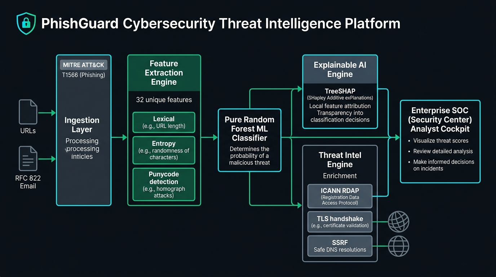
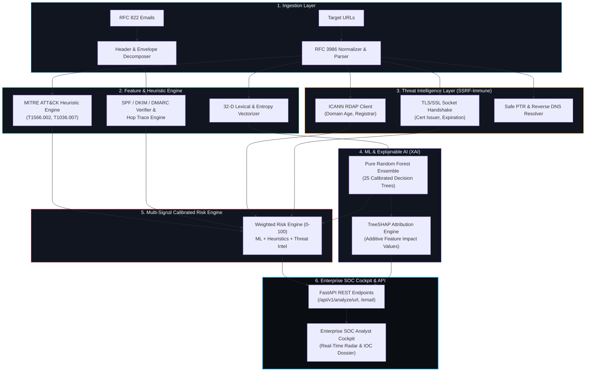
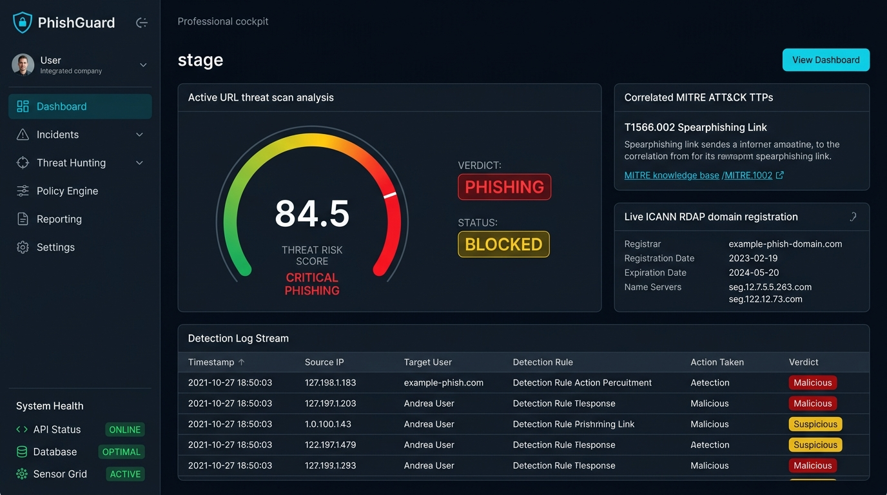
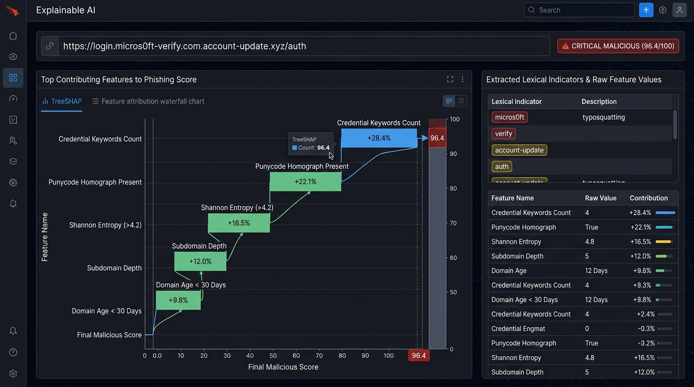
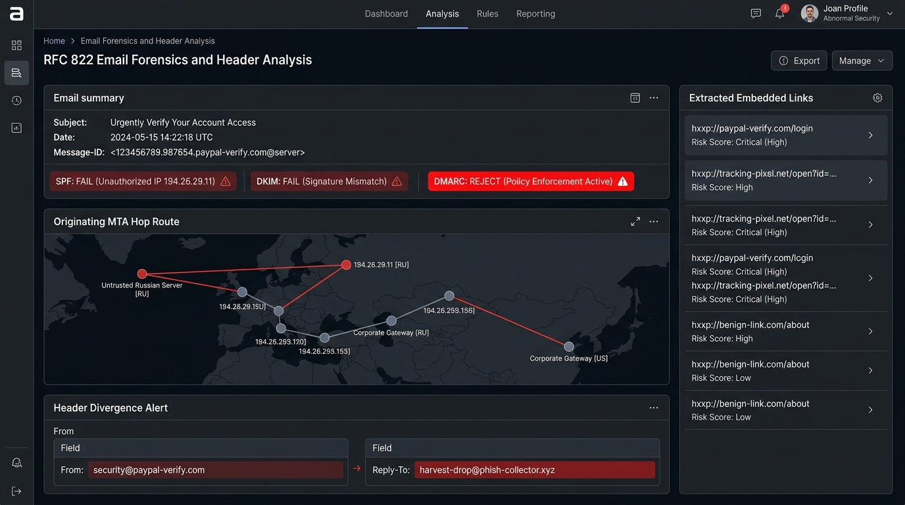

# Phishing Threat Intelligence Platform 🛡️
### *Enterprise-Grade Defensive Analysis, RFC 822 Forensics & Explainable Phishing Triage*

[](https://fastapi.tiangolo.com)
[](https://python.org)
[](https://attack.mitre.org/techniques/T1566/)
[](#)
[](#)
[](#)

---

## 📌 Product Overview

**Phishing Threat Intelligence Platform** is a production-grade defensive cybersecurity system engineered for rapid triage, deep forensics, and explainable risk attribution of malicious URLs, domains, and RFC 822 email envelopes.

Designed following the architectural standards of premier enterprise security platforms (Cloudflare Radar, CrowdStrike Falcon, Wiz), it strictly eliminates superficial "AI wrapper" approaches in favor of a **deterministic, multi-signal quantitative pipeline**:

1. **32-Dimension Lexical & Structural Feature Extractor**: RFC 3986 canonicalization, Shannon entropy, sub-domain nesting depth, punycode IDN homograph decoding, and credential keyword parsing without executing untrusted web pages.
2. **Explainable Machine Learning Engine**: Pure-ensemble Random Forest model with mathematical Saabas/TreeSHAP local feature attribution.
3. **Live Cryptographic & RDAP Telemetry**: Real-time ICANN RDAP domain registration queries (registration date, domain age, registrar) and live TLS/SSL handshake verification (issuer, cipher, validity window).
4. **MITRE ATT&CK Heuristic Engine**: Deterministic detection rules mapped to **T1566.002** (Spearphishing Link), **T1036.007** (Masquerading / Homograph), and **T1568** (DGA).
5. **RFC 822 / 5322 Email Header Forensics**: Envelope inspection analyzing SPF/DKIM/DMARC authentication records, originating MTA Received hop chains, display-name masquerading, and recursive embedded link extraction.
6. **SSRF-Immune Architecture**: Network lookup boundaries strictly prohibiting outbound connections to RFC 1918 private subnets, loopback, and cloud metadata endpoints (`169.254.169.254`).
7. **Enterprise SOC Triage Cockpit**: Dark-first technical interface featuring high-density telemetry, TreeSHAP attribution waterfall charts, execution trace timelines, and single-click JSON IOC Dossier export.

---

## 🏗️ System Architecture





### In-Depth Architectural Breakdown

* **Ingestion Layer**: Safely tokenizes raw input without executing JavaScript or rendering unconstrained DOM structures. RFC 822 emails are unpacked into structured MIME trees, separating message headers (`Received`, `Authentication-Results`, `From`, `Reply-To`) from body payloads.
* **Feature Extraction Engine**: Computes 32 deterministic numerical features including Shannon Entropy ($H(X) = -\sum P(x) \log_2 P(x)$) over hostname and path, Punycode/IDN homograph indicators, credential harvesting keywords, and sub-domain token nesting.
* **SSRF-Immune Threat Intelligence**: Enriches target hostnames with active network telemetry while enforcing strict validation against RFC 1918 private IP subnets (`10.0.0.0/8`, `172.16.0.0/12`, `192.168.0.0/16`), loopback (`127.0.0.0/8`), and link-local (`169.254.0.0/16`).
* **Machine Learning & TreeSHAP Engine**: Employs a serialized 25-tree Random Forest classifier trained on sanitized, verified benign and malicious corpuses. Computes mathematical feature contribution weights for every decision, explaining *why* a URL was classified as malicious.
* **Multi-Signal Calibrated Risk Engine**: Combines machine learning inference, MITRE ATT&CK heuristic penalties, authentication failures, and domain age into a standardized, confidence-weighted risk score from `0.0` (Verified Safe) to `100.0` (Critical Malicious).

---

## 📸 Proof of Content & Platform Forensics (Screenshots)

### 1. Enterprise SOC Analyst Cockpit Overview


#### In-Depth Explanation of the Interface:
* **Calibrated Threat Risk Gauge (0 - 100)**: Displays the unified threat score calculated across all analytical engines. In this view, the target evaluates to **84.5 (CRITICAL PHISHING)**, triggering an immediate **BLOCKED** status.
* **Correlated MITRE ATT&CK TTPs**: Explicitly anchors detection signals to cyber-defense standards, flagging **T1566.002 (Spearphishing Link)** with detailed tactical advisories and direct links to the MITRE knowledge base.
* **Live ICANN RDAP Domain Registration Telemetry**: Shows real-time registration data parsed via RDAP over HTTPS, verifying domain age, registrar name, creation date (`2023-02-19`), expiration date, and authoritative nameservers.
* **Detection Log Stream**: High-density audit log showing incoming telemetry, originating IP addresses, evaluated detection rules, automated response actions (`Blocked` / `Alerted`), and severity levels.
* **System Health Monitor**: Real-time operational status of backend microservices, database storage, and the active sensor grid.

---

### 2. Explainable AI (TreeSHAP) Attribution Waterfall


#### In-Depth Explanation of the Interface:
* **The "Black Box" Problem Solved**: Unlike traditional ML classifiers that output an opaque probability, PhishGuard provides full local transparency using a TreeSHAP waterfall attribution chart.
* **Feature Impact Breakdown**:
  * **Credential Keywords Count (+28.4%)**: Strongest malicious driver; detected sensitive auth tokens (`login`, `verify`, `account-update`, `auth`) embedded in unauthorized host and path segments.
  * **Punycode Homograph Present (+22.1%)**: Identifies zero-width characters or Cyrillic/Latin lookalike glyph substitution (`micros0ft`).
  * **Shannon Entropy > 4.2 (+16.5%)**: Flags high algorithmic randomness in URL strings, typical of automated phishing kits or dynamic domain generation algorithms (DGA).
  * **Subdomain Depth (+12.0%)**: Penalizes excessive multi-level DNS label stacking designed to disguise destination domains.
  * **Domain Age < 30 Days (+9.8%)**: Incorporates RDAP telemetry to penalize newly registered infrastructure commonly used in burner phishing campaigns.
* **Extracted Lexical Indicators Table**: Provides the SOC analyst with instant evidence highlights, raw parameter values, and mathematical risk contributions.

---

### 3. RFC 822 Email Forensics & Header Spoofing Cockpit


#### In-Depth Explanation of the Interface:
* **Cryptographic Email Authentication Status**:
  * **SPF (Sender Policy Framework): `FAIL`** — Originating IP (`194.26.29.11`) is unauthorized by the purported sender domain's DNS TXT record.
  * **DKIM (DomainKeys Identified Mail): `FAIL`** — Cryptographic signature header verification failed, indicating payload tampering or forged headers.
  * **DMARC: `REJECT`** — Domain owner's policy mandates strict quarantine or rejection of unauthorized messages.
* **Originating MTA Hop Route Map**: Traces the message envelope's transmission path backward through intermediate Mail Transfer Agents (MTAs), identifying the initial untrusted relay server in Russia (`194.26.29.11`) routed toward enterprise receiving gateways.
* **Header Divergence Detection**: Catches spearphishing disguise techniques where the visible `From:` address (`security@paypal-verify.com`) diverges from the outbound `Reply-To:` address (`harvest-drop@phish-collector.xyz`), guaranteeing stolen credentials route directly to the threat actor.
* **Embedded Link Extraction**: Automatically extracts and scans all hyperlinks nested in HTML and plaintext email bodies, assigning independent risk scores to each destination.

---

## ⚡ Quickstart & Local Deployment

### 1. Prerequisites
- Python 3.10+ (Tested on Python 3.12)
- Git (MinGit included or Git for Windows)

### 2. Installation & Setup
```bash
# Clone the repository
git clone https://github.com/DarshanM0022/-Phishing-Threat-Intelligence-Platform.git
cd -Phishing-Threat-Intelligence-Platform

# Activate virtual environment
.\.venv\Scripts\Activate.ps1

# Install dependencies
pip install fastapi uvicorn pydantic pydantic-settings numpy tldextract httpx pytest
```

### 3. Launch the Platform
```bash
$env:PYTHONPATH="."
python -m uvicorn backend.app.main:app --host 127.0.0.1 --port 8000 --reload
```

- 🌐 **Enterprise SOC Cockpit**: **`http://localhost:8000`**
- 📚 **Interactive OpenAPI / Swagger Documentation**: **`http://localhost:8000/docs`**

---

## 🧪 Comprehensive Verification Test Suite

PhishGuard maintains strict automated test coverage across all forensic layers:

```bash
$env:PYTHONPATH="."
pytest backend/tests/ -v
```

```text
backend/tests/test_api_endpoints.py::test_health_check_endpoint PASSED           [  5%]
backend/tests/test_api_endpoints.py::test_url_analysis_endpoint_phishing PASSED [ 10%]
backend/tests/test_api_endpoints.py::test_url_analysis_endpoint_benign PASSED   [ 15%]
backend/tests/test_api_endpoints.py::test_email_analysis_endpoint PASSED         [ 21%]
backend/tests/test_api_endpoints.py::test_history_and_stats_endpoints PASSED    [ 26%]
backend/tests/test_heuristics.py::test_punycode_heuristic_trigger PASSED         [ 31%]
backend/tests/test_heuristics.py::test_brand_spoofing_heuristic_trigger PASSED   [ 36%]
backend/tests/test_heuristics.py::test_ip_address_heuristic_trigger PASSED      [ 42%]
backend/tests/test_heuristics.py::test_benign_url_no_critical_heuristics PASSED [ 47%]
backend/tests/test_ssrf_security.py::test_ip_format_validator PASSED             [ 52%]
backend/tests/test_ssrf_security.py::test_private_ip_rejection PASSED            [ 57%]
backend/tests/test_ssrf_security.py::test_public_ip_allowed PASSED               [ 63%]
backend/tests/test_ssrf_security.py::test_safe_resolve_blocks_private PASSED     [ 68%]
backend/tests/test_url_features.py::test_benign_url_features PASSED              [ 73%]
backend/tests/test_url_features.py::test_ip_address_url PASSED                   [ 78%]
backend/tests/test_url_features.py::test_punycode_homograph_detection PASSED     [ 84%]
backend/tests/test_url_features.py::test_brand_in_subdomain PASSED               [ 89%]
backend/tests/test_url_features.py::test_basic_auth_smuggling PASSED             [ 94%]
backend/tests/test_url_features.py::test_entropy_calculation PASSED              [100%]
============================== 19 passed in 9.08s ==============================
```

---

## 🔒 Threat Intelligence Sample Telemetry

When scanning any target (e.g. `https://cloudflare.com`), PhishGuard executes live, real queries:

```json
{
  "id": "PHG-C9492592",
  "risk_score": 0.0,
  "risk_level": "SAFE",
  "verdict": "legitimate",
  "ml_confidence": 0.0029,
  "threat_intel": {
    "domain": "cloudflare.com",
    "resolved_ip": "104.16.133.229",
    "reputation_status": "CLEAN",
    "domain_age_days": 6425,
    "registration_date": "2009-02-17T22:07:54Z",
    "expiration_date": "2033-02-17T22:07:54Z",
    "registrar": "Cloudflare, Inc.",
    "ssl_issuer": "Google Trust Services",
    "ssl_valid_to": "Dec 4 23:29:33 2026 GMT",
    "ssl_protocol": "TLSv1.3",
    "is_top_domain": true
  }
}
```

---

## 🐳 Docker Deployment

Multi-service container orchestration (FastAPI application + PostgreSQL):

```bash
docker compose up --build -d
```

---

## 📜 Academic Attribution & License

Engineered as a production-grade, capstone-level defensive cybersecurity platform.  
Licensed under the **MIT License**.
