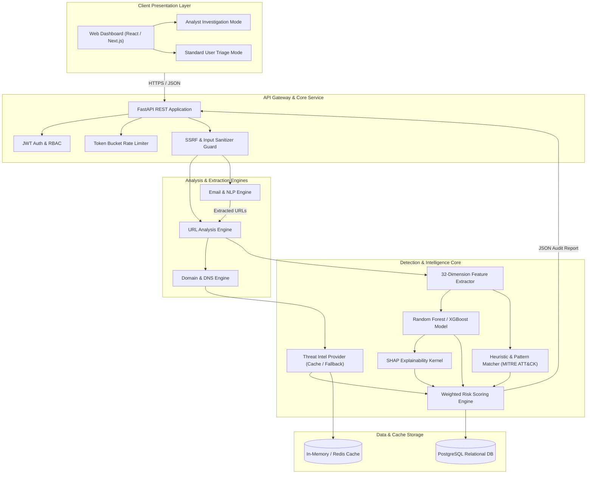

# PhishGuard AI: Architecture & Implementation Blueprint
*Explainable AI-Powered Phishing Detection and Threat Analysis Platform*

---

## 1. Executive Summary & Design Vision

**PhishGuard AI** is a defense-in-depth, explainable cybersecurity platform engineered to detect, classify, and explain phishing attempts across URLs, host domains, and email messages. 

Rather than functioning as a simplistic binary classifier or a superficial LLM wrapper, PhishGuard AI employs a **multi-signal detection ensemble**:
1. **High-Speed Lexical & Heuristic Engine**: 30+ structural, syntactic, and known-pattern indicators.
2. **Explainable Machine Learning Engine**: Random Forest / XGBoost classifier trained on balanced feature vectors with SHAP (SHapley Additive exPlanations) attribution.
3. **Email Content & NLP Pipeline**: Header inconsistency parsing, social engineering & urgency intent classification, and recursive URL extraction.
4. **Threat Intelligence Layer**: Pluggable provider architecture (DNS/RDAP reputation, IP geolocation, VirusTotal/AbuseIPDB adapters) with SSRF-safe caching.
5. **Calibrated Multi-Signal Risk Engine**: Weighted scoring model (0–100) producing transparent confidence tiers and actionable analyst defense recommendations.

---

## 2. System Architecture



---

## 3. Component Architecture (7-12 Modules)

| Module ID | Module Name | Responsibilities | Key Dependencies |
| :--- | :--- | :--- | :--- |
| **MOD-01** | `url_engine` | Lexical parsing, canonicalization, entropy calculation, TLD validation, path/query inspection. | `urllib.parse`, `tldextract`, `math` |
| **MOD-02** | `email_engine` | RFC 822/5322 header parsing, sender/reply-to mismatch, body text cleaning, embedded link extraction. | `email`, `re`, `bs4` |
| **MOD-03** | `nlp_engine` | Urgency scoring, coercive intent detection, financial/credential harvesting phrase extraction. | `scikit-learn`, `nltk` / regex lexicon |
| **MOD-04** | `feature_engine` | Aggregates and normalizes 32 structural/statistical features into numerical tensors. | `numpy`, `pandas` |
| **MOD-05** | `rule_detector` | Evaluates deterministic heuristics (punycode spoofing, IP in URL, suspicious TLDs, hex encoding). | Custom rule definitions |
| **MOD-06** | `ml_classifier` | Executes inference using trained ensemble trees; outputs class probabilities. | `scikit-learn`, `joblib`, `xgboost` |
| **MOD-07** | `shap_explainer` | Calculates exact TreeSHAP values for each feature contributing to the prediction. | `shap` |
| **MOD-08** | `threat_intel` | Abstract provider interface for VirusTotal, AbuseIPDB, Quad9 DNS, RDAP registration age. | `httpx`, `dnspython` |
| **MOD-09** | `risk_scoring` | Combines ML confidence, rule severity, NLP threat weight, and reputation signals into a 0-100 score. | Mathematical calibration |
| **MOD-10** | `narrative_gen` | Formulates SOC-grade analyst briefs and explanations based on detected indicators. | Local deterministic synthesis / LLM |
| **MOD-11** | `auth_audit` | API token management, role-based access control, immutable analysis audit trail. | `python-jose`, `passlib` |
| **MOD-12** | `dashboard_ui` | Responsive SOC triage cockpit featuring radar charts, timeline breakdown, and investigation drawer. | React, Tailwind CSS, Lucide icons |

---

## 4. Database Schema (PostgreSQL)

```mermaid
erDiagram
    USERS ||--o{ ANALYSES : creates
    ANALYSES ||--|| URL_FEATURES : contains
    ANALYSES ||--o{ EMAIL_ANALYSES : includes
    ANALYSES ||--o{ DETECTED_INDICATORS : flags
    ANALYSES ||--o{ THREAT_INTEL_REPORTS : enriches

    USERS {
        uuid id PK
        string email UK
        string hashed_password
        string role "admin | analyst | viewer"
        boolean is_active
        timestamp created_at
    }

    ANALYSES {
        uuid id PK
        uuid user_id FK
        string target_type "url | email | domain"
        text target_input
        float risk_score "0.00 to 100.00"
        string risk_level "SAFE | LOW | MEDIUM | HIGH | CRITICAL"
        float ml_probability "0.000 to 1.000"
        jsonb shap_summary
        string verdict "phishing | suspicious | legitimate"
        integer processing_time_ms
        timestamp analyzed_at
    }

    URL_FEATURES {
        uuid id PK
        uuid analysis_id FK
        integer url_length
        integer hostname_length
        integer path_length
        integer dot_count
        integer hyphen_count
        integer subdomain_count
        boolean has_ip_address
        boolean is_https
        float entropy
        boolean uses_punycode
        boolean is_shortened
        jsonb raw_feature_vector
    }

    EMAIL_ANALYSES {
        uuid id PK
        uuid analysis_id FK
        string sender
        string reply_to
        boolean sender_mismatch
        float urgency_score
        float credential_intent_score
        string[] extracted_urls
        jsonb header_anomalies
    }

    DETECTED_INDICATORS {
        uuid id PK
        uuid analysis_id FK
        string rule_id "RUL-URL-001"
        string category "lexical | behavioral | reputation | nlp"
        string severity "LOW | MEDIUM | HIGH | CRITICAL"
        string title
        text description
        float score_impact
    }

    THREAT_INTEL_REPORTS {
        uuid id PK
        uuid analysis_id FK
        string provider "virustotal | abuseipdb | rdap"
        integer malicious_votes
        integer total_votes
        integer domain_age_days
        string registrar
        string country_code
        timestamp cached_until
    }
```



---

## 5. REST API Specifications (FastAPI)

### A. Health & Status
- `GET /api/v1/health`
  - Response: `{"status": "ok", "version": "1.0.0", "ml_model_loaded": true}`

### B. Core Analysis Endpoints
- `POST /api/v1/analyze/url`
  - Request:
    ```json
    {
      "url": "https://secure-login.paypal.verify-notice.com/account/login",
      "enable_threat_intel": true,
      "include_shap": true
    }
    ```
  - Response:
    ```json
    {
      "id": "c61b2e25-1e0e-48a5-829d-4fa012e847c1",
      "target": "https://secure-login.paypal.verify-notice.com/account/login",
      "risk_score": 91.5,
      "risk_level": "HIGH",
      "verdict": "phishing",
      "ml_metrics": {
        "phishing_probability": 0.942,
        "model_version": "rf-v1.0.0"
      },
      "indicators": [
        {
          "id": "RUL-URL-002",
          "title": "Brand Impersonation in Subdomain",
          "severity": "HIGH",
          "score_impact": 25.0
        }
      ],
      "shap_contributions": [
        {"feature": "subdomain_count", "value": 3, "impact": "+0.28"},
        {"feature": "brand_keyword_present", "value": 1, "impact": "+0.22"}
      ],
      "threat_intel": {
        "domain_age_days": 4,
        "is_known_malicious": false
      },
      "executive_summary": "High risk detected. Domain contains brand impersonation keywords and was registered less than a week ago.",
      "processing_time_ms": 78
    }
    ```

- `POST /api/v1/analyze/email`
  - Request:
    ```json
    {
      "raw_email": "From: support@paypaI.com\nSubject: Urgent: Verify Account\n...",
      "check_embedded_urls": true
    }
    ```
  - Response:
    ```json
    {
      "id": "a90b4e12-4f11-4822-bc51-098823f99aa2",
      "risk_score": 88.0,
      "risk_level": "HIGH",
      "header_audit": {
        "sender_reply_mismatch": true,
        "homograph_detected": true
      },
      "nlp_audit": {
        "urgency_score": 0.85,
        "credential_harvesting_detected": true
      },
      "embedded_urls": [
        {"url": "http://paypaI-verify.xyz/login", "risk_score": 95.0}
      ]
    }
    ```

- `GET /api/v1/investigations/{id}`
  - Retrieves full timeline and SOC investigation details.
- `GET /api/v1/history`
  - Paginated recent scans with filtering by risk level.

---

## 6. Machine Learning Pipeline & Feature Engineering Registry

### A. Feature Extraction Registry (32 Quantifiable Dimensions)

| Category | Feature Name | Description | Phishing Indicator Logic |
| :--- | :--- | :--- | :--- |
| **Lexical** | `url_length` | Total characters in URL | $>75$ chars frequently correlates with payload padding |
| **Lexical** | `hostname_length` | Total characters in domain | Suspiciously long hostnames obfuscate origins |
| **Lexical** | `path_length` | Length of URL path component | Deep directory paths mimic authentic hierarchies |
| **Lexical** | `query_length` | Length of URL query parameter string | Phishing kits embed target emails or tokens in query |
| **Syntax** | `dot_count` | Number of `.` characters | $>3$ indicates subdomains or IP masking |
| **Syntax** | `hyphen_count` | Number of `-` characters | Common in synthetic deceptive domains (`secure-login`) |
| **Syntax** | `subdomain_count` | Extracted subdomains via `tldextract` | $>2$ indicates brand impersonation via multi-level subdomains |
| **Syntax** | `special_char_count` | Count of `@`, `?`, `=`, `_`, `~`, `%` | Used for basic auth spoofing or parameter smuggling |
| **Security** | `is_https` | 1 if scheme is `https`, 0 if `http` | HTTP indicates insecure submission; HTTPS can still be malicious |
| **Security** | `has_ip_hostname` | 1 if hostname is IPv4/IPv6 | Direct IP access bypasses domain takedowns |
| **Security** | `has_at_symbol` | 1 if `@` in authority | Browser ignores text before `@` in legacy URL handling |
| **Security** | `has_double_slash_path`| 1 if `//` appears inside path | Path traversal or redirect redirection trick |
| **Security** | `uses_punycode` | 1 if hostname begins with `xn--` | IDN homograph attack (e.g. Cyrillic `а` for Latin `a`) |
| **Security** | `is_shortened_url` | 1 if domain matches bit.ly, t.co, tinyurl | Masks destination URL |
| **Information**| `entropy_score` | Shannon entropy of domain string | Random strings (`a8b9x-security`) have high entropy |
| **Keywords** | `keyword_login_flag` | Boolean occurrence of `login`, `signin` | Credential harvesting focus |
| **Keywords** | `keyword_verify_flag`| Boolean occurrence of `verify`, `confirm` | Urgent verification trigger |
| **Keywords** | `keyword_bank_flag` | Boolean occurrence of `bank`, `secure`, `pay`| Financial authority spoofing |
| **Keywords** | `keyword_account_flag`| Boolean occurrence of `account`, `update` | Identity validation trigger |
| **TLD** | `suspicious_tld` | Top-level domain matches high-abuse registry (`.xyz`, `.top`, `.tk`, `.work`, `.ml`) | Free/cheap TLDs favored by malicious actors |
| **Structure** | `digit_to_alpha_ratio`| Ratio of numeric digits to alphabetic chars | High ratio in domain indicates auto-generated domains (DGA) |

### B. Machine Learning Architecture & Training
1. **Model Choices**:
   - Primary: **Random Forest Classifier** (100 estimators, max depth 12, balanced class weights).
   - Secondary comparison: **XGBoost Classifier** (evaluating tree depth vs gradient boosted trees).
2. **Explainability Kernel**:
   - `shap.TreeExplainer` computes exact local feature contributions per prediction in $<10\text{ ms}$.
3. **Evaluation Metrics**:
   - Accuracy, Precision, Recall, F1-Score, ROC-AUC.
   - Strict monitoring of False Positive Rate (FPR) and False Negative Rate (FNR) to prevent alerting fatigue in security contexts.

---

## 7. Multi-Signal Risk Scoring Methodology

The final risk score ($R \in [0, 100]$) is calculated as a calibrated ensemble:

$$R = \min\left(100, \max\left(0, w_{\text{ML}} S_{\text{ML}} + w_{\text{Rule}} S_{\text{Rule}} + w_{\text{Intel}} S_{\text{Intel}} + w_{\text{NLP}} S_{\text{NLP}} + \Delta_{\text{Critical}}\right)\right)$$

### Weights & Signal Components
- $w_{\text{ML}} = 0.40$: ML model phishing probability $\times 100$.
- $w_{\text{Rule}} = 0.25$: Cumulative heuristic penalty points (capped at 100).
- $w_{\text{Intel}} = 0.15$: Threat intelligence score (e.g., domain age $<14$ days $+40$, malicious votes $+60$).
- $w_{\text{NLP}} = 0.20$: Email urgency and credential harvesting score (if email analyzed; otherwise weight redistributed to ML and Rules).
- $\Delta_{\text{Critical}}$: **Veto Overrides** (e.g., Active Punycode Homograph or Known Blacklisted Domain automatically triggers $+50$ critical boost).

### Classification Tiers
- `0 - 20`: **SAFE** (Legitimate verified structure)
- `21 - 40`: **LOW RISK** (Minor anomalies, standard domain)
- `41 - 60`: **MEDIUM RISK** (Multiple warning indicators; caution advised)
- `61 - 80`: **HIGH RISK** (Strong phishing probability; do not interact)
- `81 - 100`: **CRITICAL RISK** (Confirmed brand impersonation / credential harvest)

---

## 8. Threat Model & Security Controls (STRIDE)

> [!IMPORTANT]
> The system itself handles untrusted, hostile input (malicious URLs and phishing emails). It must be thoroughly hardened against exploitation.

| Threat (STRIDE) | Vulnerability Vector | PhishGuard Mitigation Control |
| :--- | :--- | :--- |
| **Spoofing** | Forged sender headers in emails | Analyzes SPF/DKIM/DMARC flags and highlights Sender/Reply-To divergence. |
| **Tampering** | Parameter pollution in URL inspection | Strict URL normalization using standard RFC 3986 canonicalization. |
| **Information Disclosure**| Accidental leak of analyzed victim PII | Zero-retention policy for submitted credentials; regex scrubbing for tokens. |
| **Denial of Service** | ReDoS in regex parsing; massive payload submission | Pre-compiled linear regex (`re.finditer`), 64KB maximum payload body size limit. |
| **Elevation of Privilege**| Unauthorized API access to history | Scoped JWT tokens with role separation (`analyst` vs `user`). |
| **SSRF (Critical)** | Malicious URLs targeting internal network (`127.0.0.1`, `169.254.169.254`) | **Strict URL parsing without HTTP GET execution**. For DNS lookups, IP resolution is checked against private/loopback blocks before any socket call. |

---

## 9. Testing Strategy

1. **Synthetic & Benign Dataset**:
   - 1,000 synthetic test URLs covering known edge cases (punycode, excessive subdomains, brand prefixes, IP encodings, safe domains like google.com/github.com).
2. **Unit Testing Suite (`pytest`)**:
   - Test feature extraction invariants (length, count, entropy correctness).
   - Test rule-based triggers independently.
   - Test SSRF protection rejects RFC 1918 and loopback destinations.
3. **Integration Testing**:
   - End-to-end FastAPI endpoint tests using `TestClient`.
   - Threat intelligence provider fallback validation (when external APIs are offline or rate-limited).
4. **Model Validation Suite**:
   - Confusion matrix logging, checking that FPR on top 1,000 legitimate domains is $< 1\%$.

---

## 10. Phased Implementation Roadmap

```mermaid
flowchart LR
    S0["Stage 0: Architecture & Invariants"] --> S1["Stage 1: Foundation & API Core"]
    S1 --> S2["Stage 2: URL Feature & Rule Engine"]
    S2 --> S3["Stage 3: ML Classifier & Training"]
    S3 --> S4["Stage 4: SHAP Explainability Engine"]
    S4 --> S5["Stage 5: Email & NLP Parser"]
    S5 --> S6["Stage 6: Threat Intel & Risk Ensemble"]
    S6 --> S7["Stage 7: Modern Security Dashboard"]
    S7 --> S8["Stage 8: Verification & Docker"]
```



### Milestone Deliverables

- **Stage 0 (Current)**:
  - Base project repository initialized with `.gitignore`, `.env.example`, `GEMINI.md`, and this architecture document.
- **Stage 1 (Foundation)**:
  - FastAPI backend setup with health check, CORS, configuration loader, database connection (SQLite / PostgreSQL), and basic test harness.
- **Stage 2 (URL Analysis & Heuristic Engine)**:
  - 32-feature extraction engine, heuristic rule library, and complete unit test suite covering legitimate, suspicious, and malformed inputs.
- **Stage 3 (Machine Learning Engine)**:
  - Clean feature vector generator, model training script (`scikit-learn`), validation reports (Precision/Recall/ROC-AUC), and saved serialized model artifact.
- **Stage 4 (Explainability Layer)**:
  - `shap` integration producing feature contribution rankings and human-readable explanation factors.
- **Stage 5 (Email Phishing & NLP Analyzer)**:
  - Header mismatch detector, urgency/coercion text analysis, and embedded URL extraction.
- **Stage 6 (Threat Intelligence & Risk Ensemble)**:
  - Threat intel provider interface, DNS/reputation resolver, and weighted 0-100 risk scoring engine.
- **Stage 7 (Security Dashboard Frontend)**:
  - High-performance security analyst cockpit (React / Next.js) with live triage, indicator cards, and investigation views.
- **Stage 8 (Docker & Final Verification)**:
  - `docker-compose.yml`, end-to-end integration tests, and academic defense presentation documentation.
