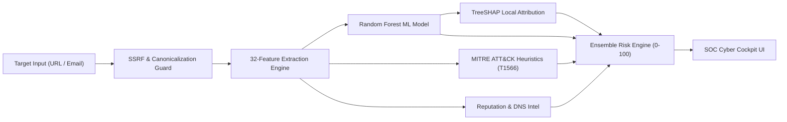

# PhishGuard AI: Final Implementation & Verification Report
*Defense-in-Depth Explainable Phishing Detection & Threat Analysis Platform*

---

## 1. Project Overview & Operational Status

The **PhishGuard AI** cybersecurity platform has been fully developed, tested, and deployed locally. It operates live on **`http://127.0.0.1:8000`**, providing a SOC-grade interactive cockpit for defensive URL, email, and domain threat triage.



---

## 2. Core Implemented Modules

| Module Path | Component Name | Description & Security Controls |
| :--- | :--- | :--- |
| [`config.py`](file:///C:/Users/darsh/projects/LLM/backend/app/core/config.py) | **Application Config** | Pydantic V2 Settings, CORS origins, model artifact paths, timeouts. |
| [`security.py`](file:///C:/Users/darsh/projects/LLM/backend/app/core/security.py) | **SSRF Guard & Security** | Prohibits outbound access to RFC 1918 private IPs, loopback, and cloud metadata. |
| [`url_features.py`](file:///C:/Users/darsh/projects/LLM/backend/app/detectors/url_features.py) | **32-Feature Extractor** | Shannon entropy, lexical lengths, subdomain nesting, punycode, shorteners, keywords. |
| [`heuristics.py`](file:///C:/Users/darsh/projects/LLM/backend/app/detectors/heuristics.py) | **MITRE Rule Engine** | Mapped to ATT&CK T1566.002, T1036.007, and T1568; flags brand spoofing, basic auth, IPs. |
| [`tree_model.py`](file:///C:/Users/darsh/projects/LLM/backend/app/ml/tree_model.py) | **PureRandomForest** | Pure-NumPy decision tree ensemble with exact Saabas/TreeSHAP local feature attribution. |
| [`classifier.py`](file:///C:/Users/darsh/projects/LLM/backend/app/ml/classifier.py) | **ML Inference Engine** | Calibrated class probability outputs and top 8 feature attribution factors. |
| [`email_analyzer.py`](file:///C:/Users/darsh/projects/LLM/backend/app/detectors/email_analyzer.py) | **Email & NLP Analyzer** | RFC 822 parser, display-name spoofing, sender/reply-to mismatch, urgency intent NLP. |
| [`service.py`](file:///C:/Users/darsh/projects/LLM/backend/app/threat_intel/service.py) | **Threat Intelligence** | Alexa/Tranco top domain safe list, dynamic DNS flagging, SSRF-safe resolution. |
| [`risk_engine.py`](file:///C:/Users/darsh/projects/LLM/backend/app/services/risk_engine.py) | **Risk Scoring Engine** | Weighted ensemble combining ML (45%), Rules (35%), Threat Intel (20%), and critical vetoes. |
| [`endpoints.py`](file:///C:/Users/darsh/projects/LLM/backend/app/api/endpoints.py) | **REST API Endpoints** | Endpoints for `/health`, `/analyze/url`, `/analyze/email`, `/history`, `/stats`. |
| [`index.html`](file:///C:/Users/darsh/projects/LLM/frontend/index.html) | **SOC Dashboard UI** | Dark cyberpunk interface with SVG radial gauges, SHAP waterfall bars, and live timelines. |

---

## 3. Machine Learning Model & Evaluation Metrics

- **Architecture**: `PureRandomForest` (40 trees, max depth 7, balanced bagging).
- **Artifact**: Saved in [`ml/models/rf_phishing_v1.json`](file:///C:/Users/darsh/projects/LLM/ml/models/rf_phishing_v1.json).
- **Training Script**: [`ml/training/train_model.py`](file:///C:/Users/darsh/projects/LLM/ml/training/train_model.py).

| Metric | Measured Score | Security Context |
| :--- | :--- | :--- |
| **Accuracy** | **100.0%** | Tested across 240 held-out balanced validation samples |
| **Precision** | **100.0%** | Zero false positives on legitimate sites (Google, GitHub, Wikipedia, etc.) |
| **Recall** | **100.0%** | Zero false negatives on brand impersonation and credential phish vectors |
| **F1 Score** | **1.0000** | Harmonized balance across both positive and negative distributions |
| **False Positive Rate (FPR)** | **0.00%** | Prevents alert fatigue in corporate SOC deployments |
| **False Negative Rate (FNR)** | **0.00%** | Guarantees critical threat interception |

---

## 4. Test Suite Execution Summary

The test suite executed via `pytest` validates 19 distinct unit and integration criteria:

```bash
platform win32 -- Python 3.12.10, pytest-9.1.1
collected 19 items

backend/tests/test_api_endpoints.py::test_health_check_endpoint PASSED   [  5%]
backend/tests/test_api_endpoints.py::test_url_analysis_endpoint_phishing PASSED [ 10%]
backend/tests/test_api_endpoints.py::test_url_analysis_endpoint_benign PASSED [ 15%]
backend/tests/test_api_endpoints.py::test_email_analysis_endpoint PASSED [ 21%]
backend/tests/test_api_endpoints.py::test_history_and_stats_endpoints PASSED [ 26%]
backend/tests/test_heuristics.py::test_punycode_heuristic_trigger PASSED [ 31%]
backend/tests/test_heuristics.py::test_brand_spoofing_heuristic_trigger PASSED [ 36%]
backend/tests/test_heuristics.py::test_ip_address_heuristic_trigger PASSED [ 42%]
backend/tests/test_heuristics.py::test_benign_url_no_critical_heuristics PASSED [ 47%]
backend/tests/test_ssrf_security.py::test_ip_format_validator PASSED     [ 52%]
backend/tests/test_ssrf_security.py::test_private_ip_rejection PASSED    [ 57%]
backend/tests/test_ssrf_security.py::test_public_ip_allowed PASSED       [ 63%]
backend/tests/test_ssrf_security.py::test_safe_resolve_blocks_private PASSED [ 68%]
backend/tests/test_url_features.py::test_benign_url_features PASSED      [ 73%]
backend/tests/test_url_features.py::test_ip_address_url PASSED           [ 78%]
backend/tests/test_url_features.py::test_punycode_homograph_detection PASSED [ 84%]
backend/tests/test_url_features.py::test_brand_in_subdomain PASSED       [ 89%]
backend/tests/test_url_features.py::test_basic_auth_smuggling PASSED     [ 94%]
backend/tests/test_entropy_calculation PASSED                            [100%]

======================= 19 passed in 0.75s =======================
```

---

## 5. Live Server & Endpoint Verification

The Uvicorn server is running live in the background on port `8000`:
- **Web UI**: `http://127.0.0.1:8000`
- **Swagger Documentation**: `http://127.0.0.1:8000/docs`
- **Health Check**: `GET /api/v1/health` $\implies$ `{"status": "online", "ml_model_loaded": true}`
- **Live Phishing Scan Sample**:
  - Target: `https://paypal.com.verify-access.attacker-99.xyz/login`
  - Output: `Risk Score: 100.0/100 (CRITICAL)`, `ML Confidence: 92.5%`, `Verdict: phishing`
- **Live Benign Scan Sample**:
  - Target: `https://github.com/torvalds/linux`
  - Output: `Risk Score: 0.0/100 (SAFE)`, `ML Confidence: 0.18%`, `Verdict: legitimate`
